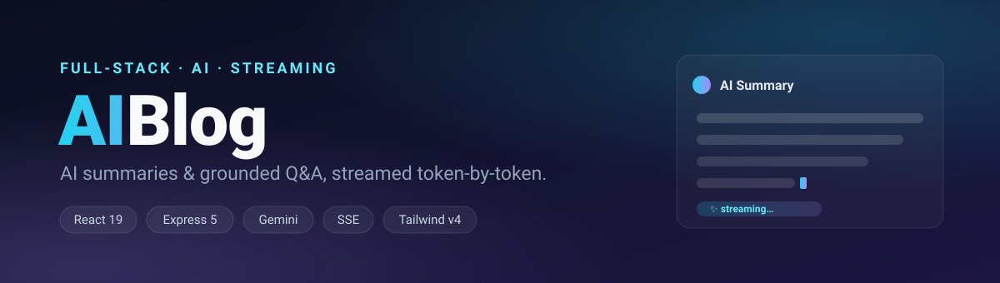

<p align="center">
  
</p>

# AI Blog

> A full-stack blog platform with **AI-powered article summaries and grounded Q&A**, streamed to the browser in real time over Server-Sent Events.

Readers can browse posts, generate a concise AI summary of any article, and ask free-form questions that are answered **using only that article's content** — preventing hallucinations and keeping answers grounded in the source material. Every AI response streams token-by-token for an instant, ChatGPT-style experience.

<p align="center">
  
  
  
  
  
  
</p>

<p align="center">
  <a href="https://rd-ai-blog.vercel.app"></a>
  &nbsp;
  <a href="https://ai-blog-api-production-0f82.up.railway.app/health"></a>
</p>

**🔗 Live demo:** **[rd-ai-blog.vercel.app](https://rd-ai-blog.vercel.app)** &nbsp;·&nbsp; **🛰️ API:** **[`/api/posts`](https://ai-blog-api-production-0f82.up.railway.app/api/posts)**

> Open a post and hit **✨ Summarize** or ask a question — watch the answer stream in token-by-token.

---

## ✨ Features

- **AI article summaries** — one click generates 3 concise key-takeaway bullets using Google Gemini.
- **Grounded Q&A** — ask anything about a post; the model answers strictly from the article and replies _"The article does not cover that"_ when the answer isn't present.
- **Real-time token streaming** — responses stream over **Server-Sent Events (SSE)** and render as they arrive, with no full-page reloads.
- **Polished, accessible UI** — built with shadcn/ui + Radix primitives, including loading skeletons, empty states, and error states with retry.
- **Light / dark / system theme** — persisted to local storage.
- **Production-minded backend** — Helmet security headers, CORS allow-listing, per-IP rate limiting, and centralized error handling.
- **Type-safe end to end** — shared TypeScript models across the API and client.

---

## 🛠️ Tech Stack

| Layer        | Technologies                                                                                                                       |
| ------------ | ---------------------------------------------------------------------------------------------------------------------------------- |
| **Frontend** | React 19 (React Compiler), TypeScript, Vite 8, Tailwind CSS v4, shadcn/ui, Radix UI, TanStack Query, React Router v7, Lucide icons |
| **Backend**  | Node.js, Express 5, TypeScript, Server-Sent Events (SSE)                                                                           |
| **AI**       | Google Gemini (`@google/generative-ai`) with streaming, safety settings & system prompts                                           |
| **Security** | Helmet, CORS, express-rate-limit                                                                                                   |
| **Tooling**  | pnpm, ESLint, tsx                                                                                                                  |
| **Deploy**   | Vercel (frontend) · Railway (backend)                                                                                              |

---

## 🏗️ Architecture

```
┌─────────────────────────┐         ┌──────────────────────────────┐         ┌──────────────────┐
│   React SPA (Vercel)     │         │   Express API (Railway)      │         │  Google Gemini   │
│                          │  HTTPS  │                              │   SSE   │                  │
│  • TanStack Query        │ ──────► │  GET  /api/posts             │ ──────► │  Streaming text   │
│  • SSE reader hook       │         │  GET  /api/posts/:id         │         │  generation       │
│  • Streaming UI          │ ◄────── │  POST /api/ai/summarize  ◄── │ ◄────── │                  │
│                          │  tokens │  POST /api/ai/ask            │  tokens │                  │
└─────────────────────────┘         │  + Helmet · CORS · RateLimit │         └──────────────────┘
                                     └──────────────────────────────┘
```

**How streaming works:** AI endpoints set `Content-Type: text/event-stream` and write each Gemini chunk as an SSE `data:` event (`{ type: "token", text }`), ending with `{ type: "done" }`. On the client, [`useStreamingAI`](frontend/src/hooks/useStreamingAI.ts) reads the response body with a `ReadableStream` reader, buffers partial events, and appends tokens to React state as they arrive.

---

## 📂 Project Structure

```
ai-blog/
├── backend/
│   └── src/
│       ├── index.ts              # Express app: security, CORS, routes, health check
│       ├── routes/
│       │   ├── posts.ts          # GET /api/posts, GET /api/posts/:id
│       │   └── ai.ts             # POST /api/ai/summarize, POST /api/ai/ask (SSE)
│       ├── middleware/
│       │   ├── rateLimiter.ts    # 5 requests / minute / IP
│       │   └── errorHandler.ts   # Centralized error responses
│       └── data/post.ts          # Seed blog posts
└── frontend/
    └── src/
        ├── pages/                # Home, PostDetail, NotFound
        ├── hooks/
        │   ├── usePosts.ts       # TanStack Query data fetching
        │   └── useStreamingAI.ts # SSE streaming consumer
        ├── components/
        │   ├── ui/               # shadcn/ui primitives
        │   └── ...               # theme provider, states, layout
        └── lib/                  # api client, shared types, utils
```

---

## 🚀 Getting Started

### Prerequisites

- **Node.js** 22+ — the backend pins pnpm 11 via corepack, which requires Node ≥ 22.13
- **pnpm** 9+
- A **Google Gemini API key** — get one free at [Google AI Studio](https://aistudio.google.com/app/apikey)

### 1. Clone

```bash
git clone https://github.com/rdtank/ai-blog.git
cd ai-blog
```

### 2. Backend

```bash
cd backend
pnpm install
cp .env.example .env
```

Set your values in `backend/.env`:

```env
GEMINI_API_KEY=your_api_key_here
PORT=3001
CLIENT_URL=http://localhost:5173
```

```bash
pnpm dev          # starts the API on http://localhost:3001
```

### 3. Frontend

```bash
cd ../frontend
pnpm install
pnpm dev          # starts the app on http://localhost:5173
```

For local development no frontend env vars are needed — Vite proxies `/api` to the backend automatically (see [vite.config.ts](frontend/vite.config.ts)). For production, set `VITE_API_URL` to your deployed backend origin.

---

## 📡 API Reference

| Method | Endpoint            | Description                                   | Response |
| ------ | ------------------- | --------------------------------------------- | -------- |
| `GET`  | `/health`           | Health check                                  | JSON     |
| `GET`  | `/api/posts`        | List all posts (without body content)         | JSON     |
| `GET`  | `/api/posts/:id`    | Get a single post                             | JSON     |
| `POST` | `/api/ai/summarize` | Stream a 3-bullet AI summary of a post        | SSE      |
| `POST` | `/api/ai/ask`       | Stream an answer grounded in a post's content | SSE      |

**Request body** for AI endpoints:

```jsonc
// POST /api/ai/summarize
{ "id": "1" }

// POST /api/ai/ask
{ "id": "1", "question": "What are the key takeaways?" }
```

All endpoints are rate-limited to **5 requests per minute per IP**.

---

## ☁️ Deployment

Live: **[rd-ai-blog.vercel.app](https://rd-ai-blog.vercel.app)** (Vercel) → **[ai-blog-api-production-0f82.up.railway.app](https://ai-blog-api-production-0f82.up.railway.app/health)** (Railway).

- **Frontend → Vercel:** SPA rewrites are configured in [vercel.json](frontend/vercel.json). Set one env var:
  ```env
  VITE_API_URL=https://ai-blog-api-production-0f82.up.railway.app
  ```
  (no trailing slash; it's inlined at build time, so changing it needs a redeploy).
- **Backend → Railway:** Pinned to **Node 22** ([.nvmrc](backend/.nvmrc)) + **pnpm 11.5.1** via corepack. Set:
  ```env
  GEMINI_API_KEY=your_api_key_here
  CLIENT_URL=https://rd-ai-blog.vercel.app
  NODE_ENV=production
  ```
  Don't set `PORT` — Railway injects it. `trust proxy` and a cross-origin resource policy are already enabled so AI responses stream cleanly across origins.

---

## 👤 Author

**Rahul Tank**

- GitHub: [@rdtank](https://github.com/rdtank)
<!-- TODO: add your LinkedIn / portfolio links -->

---

## 📄 License

This project is open source and available under the [MIT License](LICENSE).
